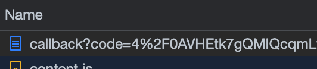

# Procedure For Obtaining Google Token

Following [Access Google Drive REST APIs using OAuth2 and Postman](https://www.linkedin.com/pulse/access-google-drive-rest-apis-using-oauth2-postman-haris-saleem/) this tutorial.

1. Create a Project in Google API Console and Enable your API
2. Create Credentials to access the API
3. Obtain an Authorization Code using created Credentials
4. Use the Authorization code as Authentication Token in Postman to access Google Drive

## Step `3.` from above.

We were given this:

```
https://accounts.google.com/o/oauth2/auth?scope=https://www.googleapis.com/auth/drive&response_type=code&access_type=offline&redirect_uri=<redirect url>&client_id=<client id>
```

Then the instructions say to

> Edit this URL to include your Client ID and Redirect URL - You can get both of them either from the credentials page or the JSON you downloaded.

I created this

```
https://accounts.google.com/o/oauth2/auth?scope=https://www.googleapis.com/auth/drive&response_type=code&access_type=offline&redirect_uri=https://oauth.pstmn.io/v1/callback&client_id=<client id>
```

I found the string for the <client id> by navigating to https://console.cloud.google.com/apis/credentials?project=<My_Personal_Dashboard_Projet>
Then to the `Credentials` button, tab, option.
Then to my `OAuth 2.0 Client IDs`. In this case it currently has the name `Web client 2`.
This last window has the `Client ID`.

Note, I change the name of the project in google console from `Quickstart`:


to `Personal Dashboard`:


Then

> Open a new Incognito window in any browser with Developer tools -> Network tab, paste this URL with updated values and open it.

> When prompted, log in with the same Google Account you used earlier and allow access.

> Extract the value of "code" parameter from this request and keep it in notepad or any text editor.

> Now, Open Postman and open a new Tab, select POST as request type with URL set to: https://accounts.google.com/o/oauth2/token

> Set Body to x-www-form-urlencoded and provide following values using your JSON or Credential manger in Console:

After I navigated to

```
https://accounts.google.com/o/oauth2/auth?scope=https://www.googleapis.com/auth/drive&response_type=code&access_type=offline&redirect_uri=https://oauth.pstmn.io/v1/callback&client_id=<client id>
```

in the browser I opened dev tools and navigated to the `Network` tab:


A detail of the Network tab in the browser dev tools:



Select the `callback?code=4%2F0AVHE...` under the `Name` column. This will display the `Payload` tab. We want to copy the value assigned to the `code` key in this tab.


## Step `4.` from above.

See the "Screenshot of Postmen" below.

Notice the `New Drive Request` in the `Collections` section of the `Side Bar`.

Also notice the `https://www.googleapis.com/drive/v3/files?` endpoint.

Lastly, I added `Content-Type` and `Authorization` to the headers. The values to these keys are `application/json` and `Bearer 4/0AVHE...` respectively.


The response after this is sent is `200`. See
