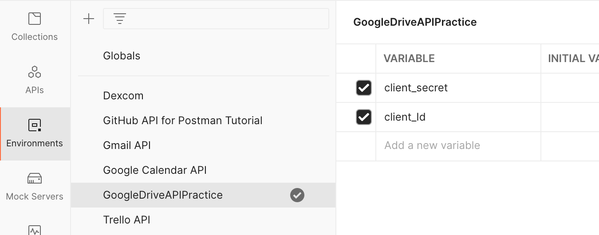
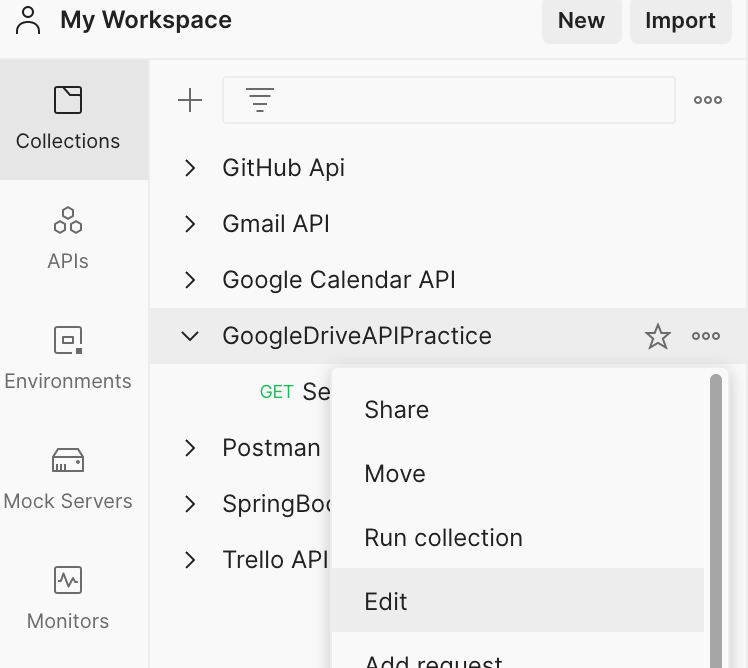
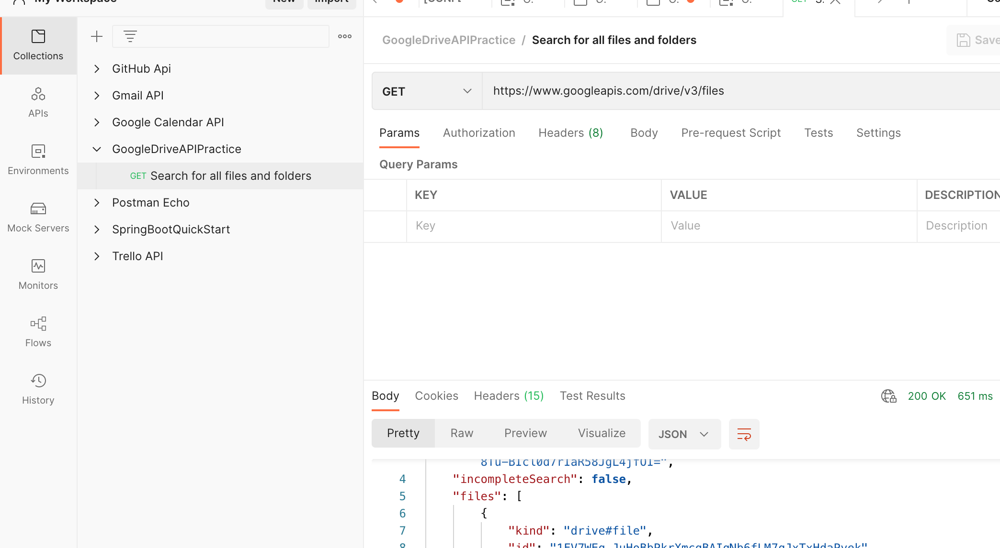
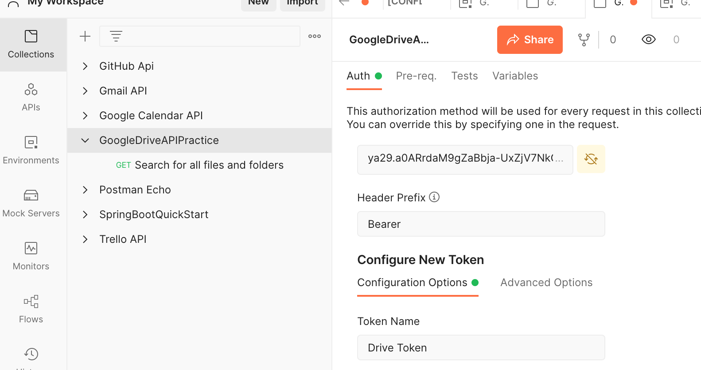
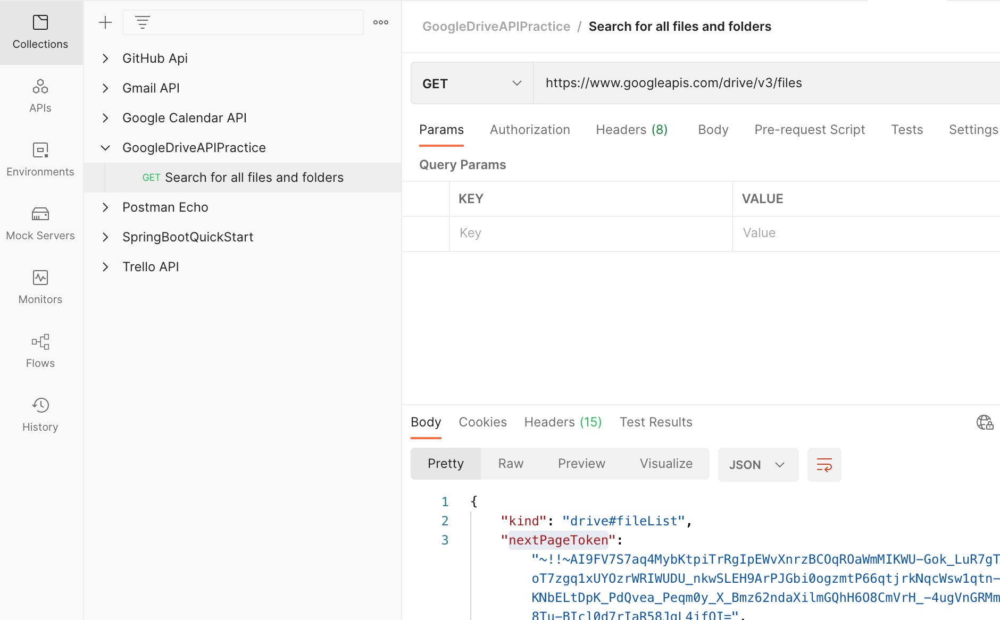

# Method

1. Obtain `client id` and `client secret` credentials.

2. Use them to obtain a `token`. I used Postman to obtain the token.

3. With the token (and using Postman) I was able to make an api call.

## Details

1. Found this [Introduction to Google Drive API](https://developers.google.com/drive/api/v3/about-sdk) document.

2. I setup my `client id` and `client secret` credentials using [Next Steps](https://developers.google.com/drive/api/v3/about-sdk#next_steps) of the above document. These two are used to obtain a `token`.

    a. To this end I followed the `2. Learn how to enable the Drive API within your app's Cloud Platform project.` instruction, 
    
    >i. specifically I navigated to the [enable the Drive API](https://developers.google.com/drive/api/v3/enable-drive-api) link.

    >ii. and I followed the instructions under the [Enable the Drive API](https://developers.google.com/drive/api/v3/enable-drive-api#enable_the_drive_api) section.
    
    b. I then followed the `3. Learn how to authenticate your users so they can access the Google Drive API with your Google Drive app.` instruction, 
    
    >i. specifically I navigated to the [Authenticate your users](https://developers.google.com/drive/api/v3/about-auth) link.

    >ii. and I followed the instructions under the [Authorizing requests with OAuth](https://developers.google.com/drive/api/v3/about-auth#OAuth2Authorizing) section.

    c. **Of note** are the info I used from yesterday's use of Postman. See https://trello.com/c/oLdgSonr/468-google-gmail-api for more info and background. **Particularly** if there are error issues.

3. ~~See the instructions on obtaining a token and making an api call via/from/in https://github.com/JamieBort/LearningDirectory/tree/master/API/Postman~~

3. To obtain a token

    a. Set up the environment.
        

    b. Set up the collection and edit it.
        
        

        and 
        
        

    c. select the orange button.

    d. [what else?]

4. Fill in the api fields

    
    and
    
