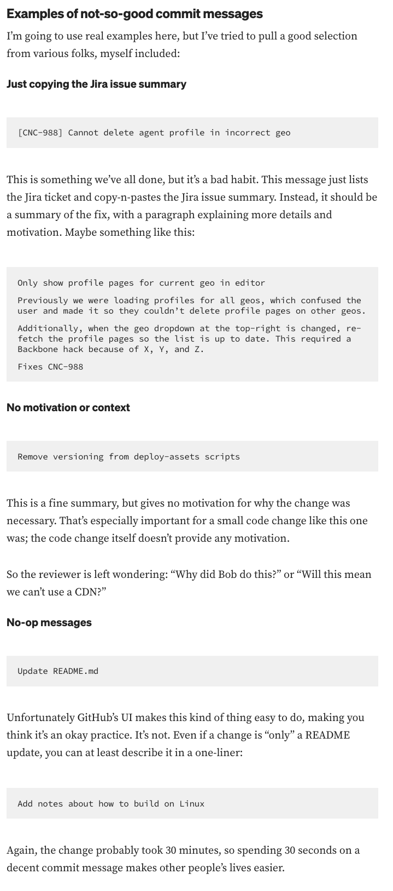
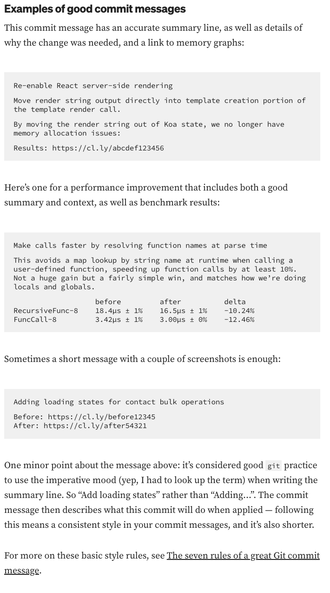

# Commit Message Notes

## Who?

## What?

From [Writing Good Commit Messages](https://medium.com/compass-true-north/writing-good-commit-messages-fc33af9d6321) by Ben Hoyt Sep 26, 2018

> A good commit message
>
> - starts with a short, one-line summary of what the fix is.
> - describes the fix, not the bug.
> - doesn't just repeat or copy-n-paste the Jira issue summary.

> - add a paragraph, or two or three if necessary
> - explaining the motivation for the change
> - how some of the moving parts fit together
> - this might include what was happening previously and why that didn’t work.

> - A commit message is like a good code comment
> - it should detail the `why?`.
> - it should not detail the what or the actual code changes — the diff does that

> - add a link to the Jira ticket or supporting information, such as the StackOverflow answer you copied the code from.

## Why?

From [Writing Good Commit Messages](https://medium.com/compass-true-north/writing-good-commit-messages-fc33af9d6321) by Ben Hoyt Sep 26, 2018

> Context - If a reviewer can see the context and motivation for a change in the commit message, they won’t have to come ask you for it.
> Good history - Good commit messages are invaluable for when we refer back to it months later.
> Increases [bus factor](https://en.wikipedia.org/wiki/Bus_factor) - Writing a thorough commit message puts all the context in your head “on paper” before you forget about it. This shares the knowledge with the reviewer, but it also documents it for the rest of the team.

- Note - `bus factor` was a new phrase to me so I kept the entire quote without paraphrasing it, link and all.

## How?

From [How to Write a Git Commit Message](https://cbea.ms/git-commit/#seven-rules) by CBEAMS 31 AUG 2014

> The seven rules of a great Git commit message
> Keep in mind: [This](https://tbaggery.com/2008/04/19/a-note-about-git-commit-messages.html) [has](https://www.git-scm.com/book/en/v2/Distributed-Git-Contributing-to-a-Project#_commit_guidelines) [all](https://github.com/torvalds/subsurface-for-dirk/blob/master/README.md#contributing) [been](https://who-t.blogspot.com/2009/12/on-commit-messages.html) [said](https://github.com/erlang/otp/wiki/writing-good-commit-messages) [before](https://github.com/spring-projects/spring-framework/blob/30bce7/CONTRIBUTING.md#format-commit-messages).
>
> 1. Separate subject from body with a blank line
> 2. Limit the subject line to 50 characters
> 3. Capitalize the subject line
> 4. Do not end the subject line with a period
> 5. Use the imperative mood in the subject line
> 6. Wrap the body at 72 characters
> 7. Use the body to explain what and why vs. how

- Note - each numbered item above has more info. Follow the link to `How to Write a Git Commit Message` by CBEAM to view it.

## Where?

## When?

## Examples of Good Commit Messages



From [How to Write a Git Commit Message](https://cbea.ms/git-commit/#seven-rules) by CBEAMS 31 AUG 2014

> Commit messages matter. Here's how to write them well.

`$ git log --oneline -5 --author cbeams --before "Fri Mar 26 2009"`
`e5f4b49 Re-adding ConfigurationPostProcessorTests after its brief removal in r814. @Ignore-ing the testCglibClassesAreLoadedJustInTimeForEnhancement() method as it turns out this was one of the culprits in the recent build breakage. The classloader hacking causes subtle downstream effects, breaking unrelated tests. The test method is still useful, but should only be run on a manual basis to ensure CGLIB is not prematurely classloaded, and should not be run as part of the automated build.`
`2db0f12 fixed two build-breaking issues: + reverted ClassMetadataReadingVisitor to revision 794 + eliminated ConfigurationPostProcessorTests until further investigation determines why it causes downstream tests to fail (such as the seemingly unrelated ClassPathXmlApplicationContextTests)`
`147709f Tweaks to package-info.java files`
`22b25e0 Consolidated Util and MutableAnnotationUtils classes into existing AsmUtils`
`7f96f57 polishing`

```
$ git log --oneline -5 --author cbeams --before "Fri Mar 26 2009"

e5f4b49 Re-adding ConfigurationPostProcessorTests after its brief removal in r814. @Ignore-ing the testCglibClassesAreLoadedJustInTimeForEnhancement() method as it turns out this was one of the culprits in the recent build breakage. The classloader hacking causes subtle downstream effects, breaking unrelated tests. The test method is still useful, but should only be run on a manual basis to ensure CGLIB is not prematurely classloaded, and should not be run as part of the automated build.
2db0f12 fixed two build-breaking issues: + reverted ClassMetadataReadingVisitor to revision 794 + eliminated ConfigurationPostProcessorTests until further investigation determines why it causes downstream tests to fail (such as the seemingly unrelated ClassPathXmlApplicationContextTests)
147709f Tweaks to package-info.java files
22b25e0 Consolidated Util and MutableAnnotationUtils classes into existing AsmUtils
7f96f57 polishing
```

## Examples of Good Bad Messages



From [How to Write a Git Commit Message](https://cbea.ms/git-commit/#seven-rules) by CBEAMS 31 AUG 2014

> Commit messages matter. Here's how to write them well.

```
$ git log --oneline -5 --author pwebb --before "Sat Aug 30 2014"

5ba3db6 Fix failing CompositePropertySourceTests
84564a0 Rework @PropertySource early parsing logic
e142fd1 Add tests for ImportSelector meta-data
887815f Update docbook dependency and generate epub
ac8326d Polish mockito usage

```
