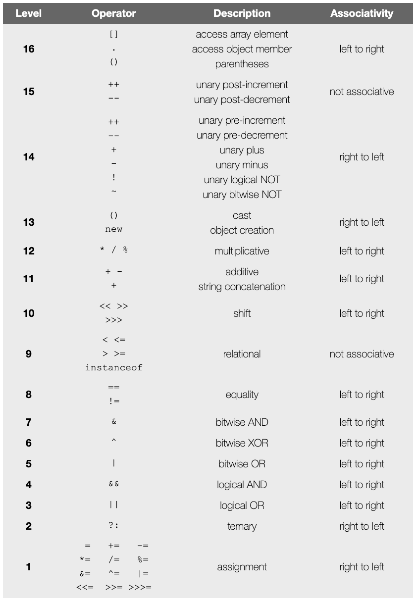

# WhatIveLearned/Section03FirstSteps.md

<!-- used this to populate the video titles https://docs.google.com/spreadsheets/d/1T5__se_ChZxoXZvkZaOl9QkjPdeYXxXMbDBR9tFP__k/edit#gid=656806513 -->

## Section 3 - First Steps
Section03FirstSteps
### 19 - Introduction

### 20 - Hello World Project
Keywords
* Access modifiers
  * public
* Class

### 21 - Defining the Main Method
Main method
Method declaration
Parameters

Keywords
* Access modifiers
  * static
  * void
  
Process finished with exit code 0
Code block
Statement - It can include one or more expressions and we'll be talking about expressions and a related topic operators later in the course.

### 22 - Hello World Challenge and Common Errors
String literal
Challenge. Too simple to complete.

### 23 - Variables
Variables
int
expressions - "what is after the equals sign". A construct that evaluates to a single value.

### 24 - Starting out with Expressions

### 25 - Primitive Types
25PrimitiveTypes/
Primitive_Types_25.java

Primitive Data Types

Eight primitive types
* boolean
* byte
* char
* short
* int
* long
* float
* double

`integers` are covered in this video.
integers are primative. They're different from Integers, which are Objects. And are wrapper classes. 

Java uses wrapper classes for all 8 primitive types.

Wrapper class
* int -> Integer

from: the Primitive_Types_25.java class
int myMinIntValue = Integer.MIN_VALUE;
int myMaxIntValue = Integer.MAX_VALUE;
System.out.println("Integer Minimum Value = " + myMinIntValue); // Integer Minimum Value = -2147483648
System.out.println("Integer Maximum Value = " + myMaxIntValue); // Integer Maximum Value = 2147483647

// An `overflow` occurred. Because we exceded the max value of this variable/type.
System.out.println("Busted MAX value = " + (myMaxIntValue + 1)); // Busted MAX value = -2147483648

// An `underflow` occurred. Because we exceded the max value of this variable/type.
System.out.println("Busted MIN value = " + (myMinIntValue - 1)); // Busted MIN value = 2147483647

**done with this video**

### 26 - byte, short, long and width

### 27 - Casting in Java
27CastingInJava
Casting_In_Java_27.java

### 28 - Primitive Types Challenge
Challenge - not done yet. I'm getting a negative number. Not able to get a negative number again. Has something to do with casting, autoboxing, or the like.

### 29 - float and double Primitive Types
float_and_double_Primitive_Types_29
Watched. See files for notes.

### 30 - Floating Point Precision and a Challenge
Floating_Point_Precision_and_a_Challenge_30
30FloatingPointPrecisionAndAChallenge

* Float is single precision number.
* Double is double precision number.
* Double is more precise than float.
* Double takes twice the space as a float.
* Double is faster than float.
* Java will look at a floating point number and assume it's a double if the number isn't explicitly named as a float when the variable is assigned. Even if it's instantiated as a float.
* Java libraries are often written to return doubles rather than floats.
* Underscores are ignored in digits: 3_456_123_455.328_271 is read as 3456123455.328271
* When more precision is needed than float and double can give, BigDecimal object is needed.

Done with video.

### 31 - The char and boolean Primitive Data Types

### 32 - Primitive Types Recap and the String Data Type

### 33 - Operators, Operands and Expressions

### 34 - Abbreviating Operators

### 35 - if-then Statement

### 36 - Logical and Operator

### 37 - Logical OR Operator

### 38 - Assignment Operator VS Equals to Operator

### 39 - Ternary Operator
Ternary_Operator_39.java
Not much too it.

### 40 - Operator Precedence and Operator Challenge

See https://introcs.cs.princeton.edu/java/11precedence/ (the url he gave http://www.cs.bilkent.edu.tr/~guvenir/courses/CS101/op_precedence.html I don't have access to.)

#### Appendix A: Operator Precedence in Java

Java has well-defined rules for specifying the order in which the operators in an expression are evaluated when the expression has several operators. For example, multiplication and division have a higher precedence than addition and subtraction. Precedence rules can be overridden by explicit parentheses.

**Precedence order**. When two operators share an operand the operator with the higher precedence goes first. For example, 1 + 2 * 3 is treated as 1 + (2 * 3), whereas 1 * 2 + 3 is treated as (1 * 2) + 3 since multiplication has a higher precedence than addition.

**Associativity**. When an expression has two operators with the same precedence, the expression is evaluated according to its associativity. For example x = y = z = 17 is treated as x = (y = (z = 17)), leaving all three variables with the value 17, since the = operator has right-to-left associativity (and an assignment statement evaluates to the value on the right hand side). On the other hand, 72 / 2 / 3 is treated as (72 / 2) / 3 since the / operator has left-to-right associativity. Some operators are not associative: for example, the expressions (x <= y <= z) and x++-- are invalid.

**Precedence and associativity of Java operators**. The table below shows all Java operators from highest to lowest precedence, along with their associativity. Most programmers do not memorize them all, and even those that do still use parentheses for clarity.

There is no explicit operator precedence table in the Java Language Specification. Different tables on the web and in textbooks disagree in some minor ways.

**Order of evaluation of subexpressions**. Associativity and precedence determine in which order Java applies operators to subexpressions but they do not determine in which order the subexpressions are evaluated. In Java, subexpressions are evaluated from left to right (when there is a choice). So, for example in the expression A() + B() * C(D(), E()), the subexpressions are evaluated in the order A(), B(), D(), E(), and C(). Although, C() appears to the left of both D() and E(), we need the results of both D() and E() to evaluate C(). It is considered poor style to write code that relies upon this behavior (and different programming languages may use different rules).

**Short circuiting**. When using the conditional and and or operators (&& and ||), Java does not evaluate the second operand unless it is necessary to resolve the result. This allows statements like if (s != null && s.length() < 10) to work reliably. Programmers rarely use the non short-circuiting versions (& and |) with boolean expressions.

**Precedence order gone awry**. Sometimes the precedence order defined in a language do not conform with mathematical norms. For example, in Microsoft Excel, -a^b is interpreted as (-a)^b instead of -(a^b). So -1^2 is equal to 1 instead of -1, which is the values most mathematicians would expect. Microsoft acknowledges this quirk as a “design choice.” One wonders whether the programmer was relying on the C precedence order in which unary operators have higher precedence than binary operators. This rule agrees with mathematical conventions for all C operators, but fails with the addition of the exponentiation operator. Once the order was established in Microsoft Excel 2.0, it could not easily be changed without breaking backward compatibility.

### 41 - First Steps Summary

### 42 - End of Remaster