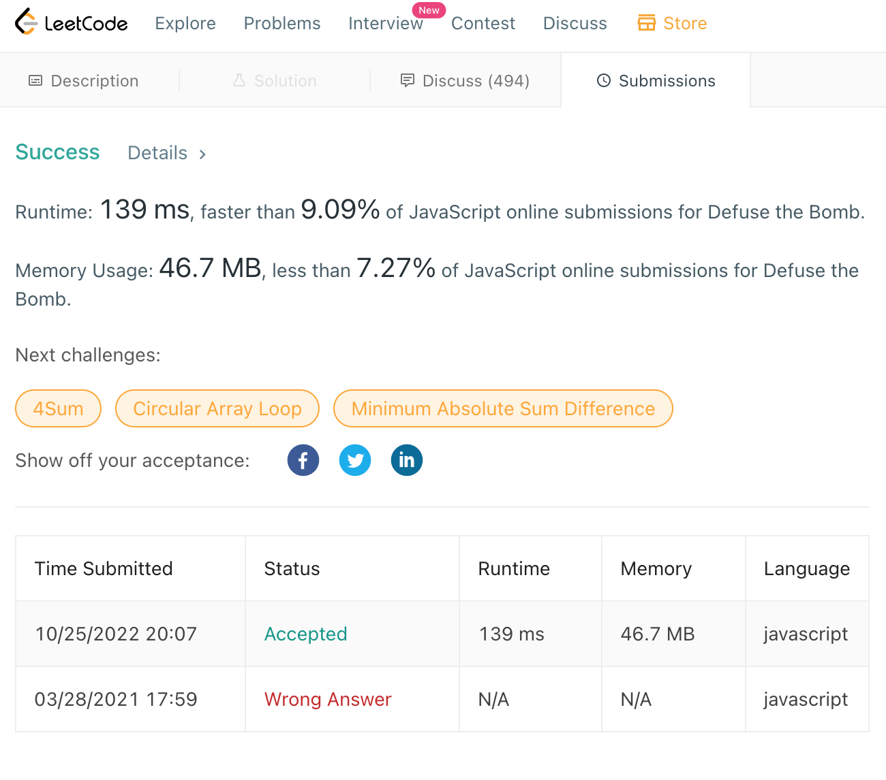

# 1652 Defuse The Bomb

## Status

Submitted successfully.

See

```
Success
Details 
Runtime: 139 ms, faster than 9.09% of JavaScript online submissions for Defuse the Bomb.
Memory Usage: 46.7 MB, less than 7.27% of JavaScript online submissions for Defuse the Bomb.

```

And 



~~Mostly completed. 
Needs some fixing and cleaning up.
Leetcode's [Defuse The Bomb](https://github.com/JamieBort/LearningDirectory/tree/master/JavaScript/CodingChallenges/LeetCode/DefuseTheBomb#status) is almost completed. And it's a quick fix.~~

## Problem

### Problem URl

https://leetcode.com/problems/defuse-the-bomb/

### Problem Statement

```
You have a bomb to defuse, and your time is running out! Your informer will provide you with a circular array code of length of n and a key k.

To decrypt the code, you must replace every number. All the numbers are replaced simultaneously.

If k > 0, replace the ith number with the sum of the next k numbers.

If k < 0, replace the ith number with the sum of the previous k numbers.

If k == 0, replace the ith number with 0.

As code is circular, the next element of code[n-1] is code[0], and the previous element of code[0] is code[n-1].

Given the circular array code and an integer key k, return the decrypted code to defuse the bomb!

Example 1:

Input: code = [5,7,1,4], k = 3

Output: [12,10,16,13]

Explanation: Each number is replaced by the sum of the next 3 numbers. The decrypted code is [7+1+4, 1+4+5, 4+5+7, 5+7+1]. Notice that the numbers wrap around.

Example 2:

Input: code = [1,2,3,4], k = 0

Output: [0,0,0,0]

Explanation: When k is zero, the numbers are replaced by 0. 

Example 3:

Input: code = [2,4,9,3], k = -2

Output: [12,5,6,13]

Explanation: The decrypted code is [3+9, 2+3, 4+2, 9+4]. Notice that the numbers wrap around again. If k is negative, the sum is of the previous numbers.
 

Constraints:

n == code.length

1 <= n <= 100

1 <= code[i] <= 100

-(n - 1) <= k <= n - 1
 ```

## Directories and Files

### Directories

~~Directory01/ - list the contents of this directory. it's purpose, etc.~~

~~Directory02/ - list the contents of this directory. it's purpose, etc.~~

### Files

attempt01.js - I am not sure. ~~The file used for the first attempt at solving the problem.~~

attempt02.js - I am not sure. ~~The file used for the first attempt at solving the problem.~~

attempt03.js - I am not sure. ~~The file used for the first attempt at solving the problem.~~

attempt04.js - I am not sure. ~~The file used for the first attempt at solving the problem.~~

attempt05.js - Completed.

attempt06.js - Identical to `attempt05.js` except the unused code has been deleted.

README.md - this file.

Screenshot.png - used for this README file.