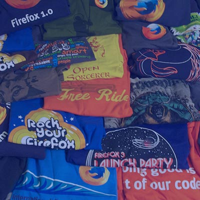

from: https://newline.theironyard.com/cohorts/15/courses/9/activities/170

# Activity: ACME Design DOM Manipulation - Pair Programming
In this activity, use DOM manipulation to dynamically add content to the page to match the given mockup.


Complete the following three tasks:
## 1. Add Content to the `hero` Section  
The `hero` section is missing two lines of HTML. Use JavaScript to create the two missing HTML elements and complete the section with an id of `hero`. Once completed, the section should look like this:
```<section id="hero">
    <h1>ACME Design Studio</h1>
    <p>We are dedicated to producing the best designs in the world.</p>
</section>
```

## 2. Add Content to the `portfolio` Section.  
The unordered list should contain four `li` tags, all of which should contain an `img` tag and an `h2` tag. Dynamically add all of the content to the unordered list using DOM manipulation.

To complete this task, iterate over the `portfolioData` array and parse the objects to construct the HTML elements. Add content to them and then append them to the unordered list inside the section with an id of `portfolio`.

Once completed, the section should look like this:
```<section id="portfolio">
    <ul>
       <li>
            
            <h2>Boats</h2>
        </li>
        <li>
            
            <h2>Hair Styles</h2>
        </li>
        <li>
            
            <h2>t Shirts</h2>
        </li>
        </li>
            
            <h2>Dirt</h2>
        </li>
    </ul>
</section>
```
## 3. Add an Event Listener to the `dropdown` Button to Toggle Visibility on the Main Navigation.  
To toggle visibility, add and remove the "visible" class from the `nav` element.

Hidden
```<nav id="main_navigation">
    <a href="index.html">Home</a>
    <a href="about_us.html">About Us</a>
    <a href="contact.html">Contact</a>
    <a href="portfolio.html">Our Work</a>
</nav>
```
Visible
```<nav id="main_navigation" class="visible">
    <a href="index.html">Home</a>
    <a href="about_us.html">About Us</a>
    <a href="contact.html">Contact</a>
    <a href="portfolio.html">Our Work</a>
</nav>
```
The following `.gif` demonstrates the desired behavior


## Getting Started
[Source File]().
1. Download the `.zip` file and unpack the contents.
2. Open the `starter_files` folder in your text editor.
3. Review the `index.html`, `style.css`, and `script.js` files.
4. Complete all tasks for this activity.
## Solutions Folder  
This `.zip` file includes a solutions folder with JavaScript for all three tasks of this activity.

## Your role as a student
Articulate their ideas as best you can. Try to facilitate effective collaboration with your paired student. Be willing to debate strategies for how best to approach your challenge, but don’t allow endless debate to keep you from making progress. Keep your eye on the clock and try to work yourself through the challenge at a reasonable pace. You and your partner should share the responsibility for authoring ideas and code. Finish your challenge and make certain that you call talk someone through the logic and strategies implemented by your group.
