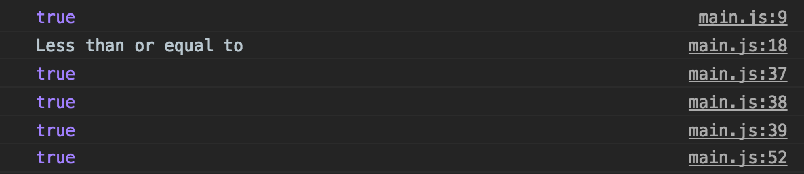

from: https://newline.theironyard.com/cohorts/15/courses/9/activities/155

# Activity: Functions and Parameters - Pair Programming

Download and work through all of the problems in `main.js` with your teammate. Your console should look like the following once you've worked through all of the problems.

[Fork to the starter files and solutions](https://github.com/tiy-raleigh-java/Functions-and-Parameters-Pair-programming)

Do not open `solutions.js` until you've solved the problems. When complete, review your solutions and compare with `solutions.js`.

## Your role as a student

Articulate their ideas as best you can. Try to facilitate effective collaboration with your paired student. Be willing to debate strategies for how best to approach your challenge, but don’t allow endless debate to keep you from making progress. Keep your eye on the clock and try to work yourself through the challenge at a reasonable pace. You and your partner should share the responsibility for authoring ideas and code. Finish your challenge and make certain that you call talk someone through the logic and strategies implemented by your group.
