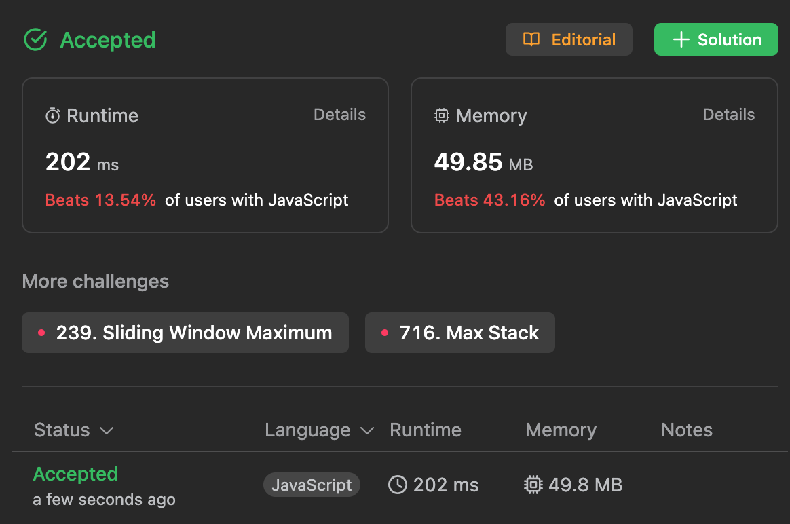

# 0155 Min Stack

## Status

Completed.

See



## Problem

### Problem URl

https://leetcode.com/problems/min-stack/

### Problem Statement

Design a stack that supports push, pop, top, and retrieving the minimum element in constant time.

- push(x) -- Push element x onto stack.
- pop() -- Removes the element on top of the stack.
- top() -- Get the top element.
- getMin() -- Retrieve the minimum element in the stack.

Example 1:

```
Input
["MinStack","push","push","push","getMin","pop","top","getMin"]
[[],[-2],[0],[-3],[],[],[],[]]

Output
[null,null,null,null,-3,null,0,-2]

Explanation
MinStack minStack = new MinStack();
minStack.push(-2);
minStack.push(0);
minStack.push(-3);
minStack.getMin(); // return -3
minStack.pop();
minStack.top();    // return 0
minStack.getMin(); // return -2
```

Constraints:

- `-2^31 <= val <= 2^31 - 1`

- Methods `pop`, `top` and `getMin` operations will always be called **on non-empty** stacks.

- At most `3 * 10^4` calls will be made to `push`, `pop`, `top`, and `getMin`.

## Directories and Files

### Directories

Directory02/ - Doesn't exist.

### Files

attempt01.js - Done.

README.md - this file.
