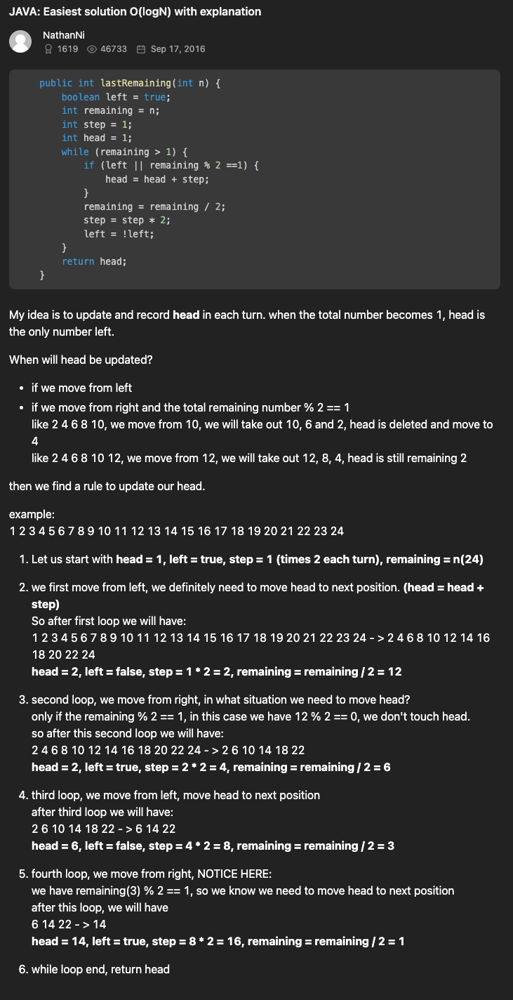

# Great Explanation

From [JAVA: Easiest solution O(logN) with explanation](<https://leetcode.com/problems/elimination-game/solutions/87119/JAVA:-Easiest-solution-O(logN)-with-explanation/>)

I am creating this file in case the link above no longer works.

---

JAVA: Easiest solution O(logN) with explanation

NathanNi
1619
46733
Sep 17, 2016

```
public int lastRemaining(int n) {
    boolean left = true;
    int remaining = n;
    int step = 1;
    int head = 1;
    while (remaining > 1) {
        if (left || remaining % 2 ==1) {
            head = head + step;
        }
        remaining = remaining / 2;
        step = step * 2;
        left = !left;
    }
    return head;
}
```

My idea is to update and record head in each turn. when the total number becomes 1, head is the only number left.

When will head be updated?

- if we move from left
- if we move from right and the total remaining number % 2 == 1
  like 2 4 6 8 10, we move from 10, we will take out 10, 6 and 2, head is deleted and move to 4
  like 2 4 6 8 10 12, we move from 12, we will take out 12, 8, 4, head is still remaining 2

then we find a rule to update our head.

example:
1 2 3 4 5 6 7 8 9 10 11 12 13 14 15 16 17 18 19 20 21 22 23 24

1. Let us start with head = 1, left = true, step = 1 (times 2 each turn), remaining = n(24)

2. we first move from left, we definitely need to move head to next position. (head = head + step)
   So after first loop we will have:
   1 2 3 4 5 6 7 8 9 10 11 12 13 14 15 16 17 18 19 20 21 22 23 24 - > 2 4 6 8 10 12 14 16 18 20 22 24
   head = 2, left = false, step = 1 \* 2 = 2, remaining = remaining / 2 = 12

3. second loop, we move from right, in what situation we need to move head?
   only if the remaining % 2 == 1, in this case we have 12 % 2 == 0, we don't touch head.
   so after this second loop we will have:
   2 4 6 8 10 12 14 16 18 20 22 24 - > 2 6 10 14 18 22
   head = 2, left = true, step = 2 \* 2 = 4, remaining = remaining / 2 = 6

4. third loop, we move from left, move head to next position
   after third loop we will have:
   2 6 10 14 18 22 - > 6 14 22
   head = 6, left = false, step = 4 \* 2 = 8, remaining = remaining / 2 = 3

5. fourth loop, we move from right, NOTICE HERE:
   we have remaining(3) % 2 == 1, so we know we need to move head to next position
   after this loop, we will have
   6 14 22 - > 14
   head = 14, left = true, step = 8 \* 2 = 16, remaining = remaining / 2 = 1

6. while loop end, return head


