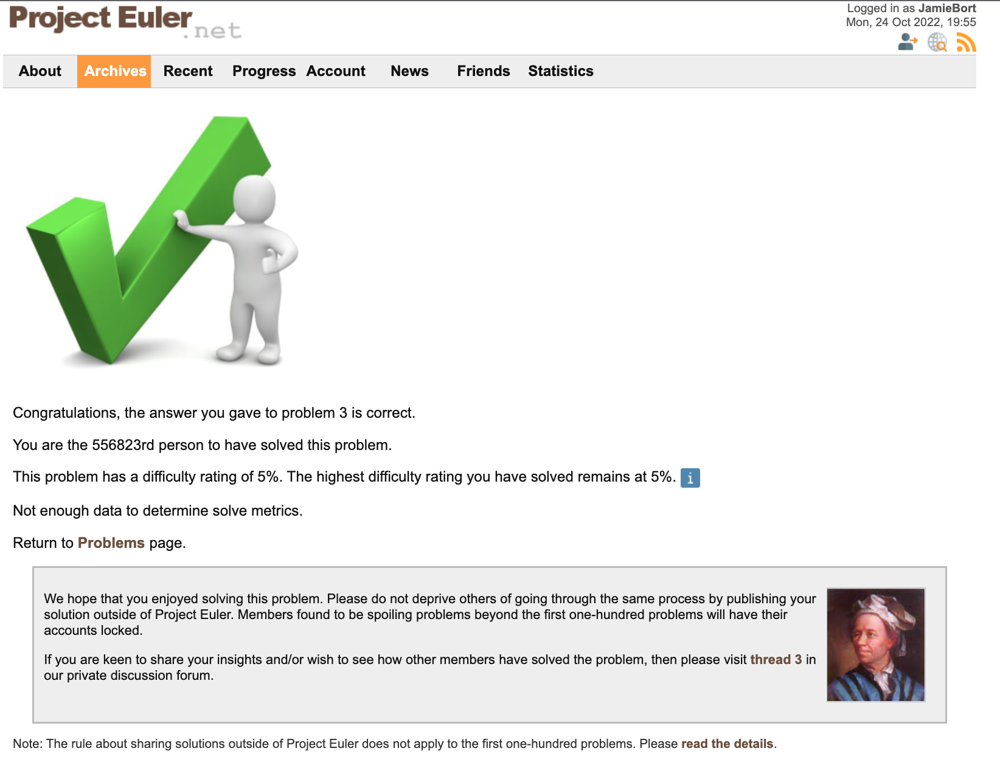

# 003LargestPrimeFactorProjectEulerJavaScript

Old title: LargestPrimeFactorProjectEulerJavaScript

LargestPrimeFactor ProjectEuler JavaScript

## Status

"Solved" with the correct answer. See:


and:



"Congratulations, the answer you gave to problem 3 is correct.

You are the 556823rd person to have solved this problem.

This problem has a difficulty rating of 5%. The highest difficulty rating you have solved remains at 5%. 

Not enough data to determine solve metrics.

Return to Problems page.


We hope that you enjoyed solving this problem. Please do not deprive others of going through the same process by publishing your solution outside of Project Euler. Members found to be spoiling problems beyond the first one-hundred problems will have their accounts locked.

If you are keen to share your insights and/or wish to see how other members have solved the problem, then please visit thread 3 in our private discussion forum.

Note: The rule about sharing solutions outside of Project Euler does not apply to the first one-hundred problems. Please read the details."

But the code is ugly. It needs to be cleaned up. 
Additionally, it's not efficient.

## Problem

Problem URL: https://projecteuler.net/problem=3

Problem Statement
```
Largest prime factor
Problem 3
The prime factors of 13195 are 5, 7, 13 and 29.

What is the largest prime factor of the number 600851475143 ?
```

## Outline for solution

1. Create list of all prime numbers less than the given number, 600851475143.

    Call this list `compete_list_of_prime_numbers`. 

2. Starting with the smallest prime number in `compete_list_of_prime_numbers`, divide the given number by the list of prime numbers until first quotient is an integer. 

    Call this value `q1`

3. Then, again starting with the smallest integer in `compete_list_of_prime_numbers`, divide `q1` until the subsequent quotient is an integer. 

    Call it `q2`.

    a. if `q2` is 1, stop. This  `q1` is prime. Go on to step 4.

    b. if `q2` is no 1, repeat the process in step 3 above until the quotient is equal to 1. At which point, the previous quotient is prime.

4. (Finding the next prime in 600851475143)


## Directories and Files

### Directories

### Files

attempt01.js - nothing worthwhile.

attempt02.js - nothing worthwhile.

attempt03.js - Close to a solution.

attempt04.js - A "Solution" for the example. Doesn't work for the number given to solve the problem.

attempt05.js -
.
.
.
attempt07.js - successful with the example.

README.md - this file.

## Prime Factorization Method

Division Method
The steps to calculate the prime factors of a number is similar to the process of finding the factors of a large number. Follow the below steps to find the prime factors of a number using the division method:

Step 1: Divide the given number by the smallest prime number. In this case, the smallest prime number should divide the number exactly.
Step 2: Again, divide the quotient by the smallest prime number.
Step 3: Repeat the process, until the quotient becomes 1.
Step 4: Finally, multiply all the prime factors