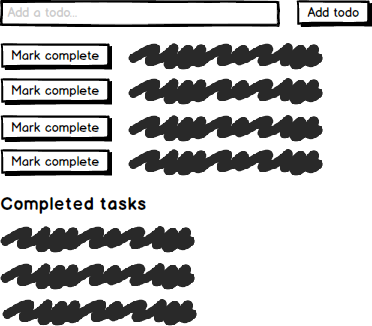

from:https://newline.theironyard.com/cohorts/15/courses/10/projects/76

TODO:

-[X] 1. Redo assignment to learn it better.

-[X] 2. Come back to include a 'Done' button so that the completed items are moved down to the 'Done' list.

-[X] 3. Come back to add some styling.

-[X] 4. Remove 'old' directory.

-[ ] 5. Push to gh-pages

**Build a todo list**
Using Express and an in-memory data structure, build a real todo list application.

Use Express to build a todo list application. In order to keep the list of todos, you will need to create some data structure and update it from Express, like this example:

  const todos = [
    "Wash the car"
  ];

  app.get("/", function (req, res) {
    res.render('index', { todos: todos });
  });

  app.post("/", function (req, res) {
    todos.push(req.body.todo);
    res.redirect('/');
  })

You should be able to add new todos and mark todos as complete. Your application might look like this mockup.

Because your data is being stored in memory, it will disappear every time your app is restarted. It is easiest to seed some todos and completed todos at the start of your app so that you can see them after a restart.

**Hard Mode**

Consider a way to persist your data permanently so that you can stop and start your app without losing your todos. [jsonfile](https://www.npmjs.com/package/jsonfile) is one option.
