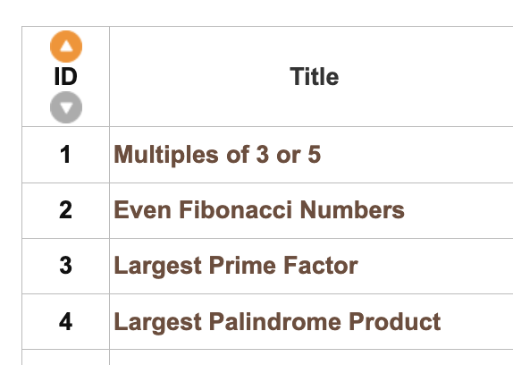

## Associated Links

### Resources

- Discussion forum: https://projecteuler.net/thread=20

---

# ProjectEuler

## Purpose

The purpose of this directory is to house the <!-- [...]. -->

## About

This directory houses information about [name_of_the_directory_that_this_readme_file_is_in].

<!-- [Some information about this directory.] -->

## Status

See the Project Euler [Coding Challenge Status](https://docs.google.com/spreadsheets/d/10YrY8K-pfzFaiObyjOPFbDnwkBQdjMw7VCdLe7lx2tQ/edit?gid=0#gid=0&fvid=1919540529) for Python in the Google Doc spreadsheet for this info.

<!-- ## Use cases

Theres a need for use cases somewhere.

TODO: Think about this. -->

<!-- ## Table Of Contents NOTE: For when I start to add them. See https://github.com/JamieBort/Learning-Directory/issues/254 -->

## Resources

Resources relevant to this directory.

### Resources to explore

These will be deleted when I am done with them. If they are of use they'll be moved to the [Vetted Resources](#vetted-resources) section below. Or a relevant file/directory in this directory.

<!-- - first resource

- second resource -->

### Vetted Resources

## Directories and Files

Information regarding the directories and files in this directory.

Navigate back to the `CodingChallenges/` [README.md](../README.md) file.

### Directories

The name of the directories come from the the concatenation of the problem id and the problem name.
See  from https://projecteuler.net/archives.

<!-- #### [directory_name/](./path_to_directory) -->

<!-- [About_this_directory.]

[More_info_about_this_directory.] -->

<!-- The `directory_name/` [README.md](./directory_name/README.md) file. -->

### Files

<!-- #### [name_of_other_file_in_here.extension]()

[About_this_file.]

[More_info_about_this_file.] -->

#### [README.md](./README.md)

This readme file.
