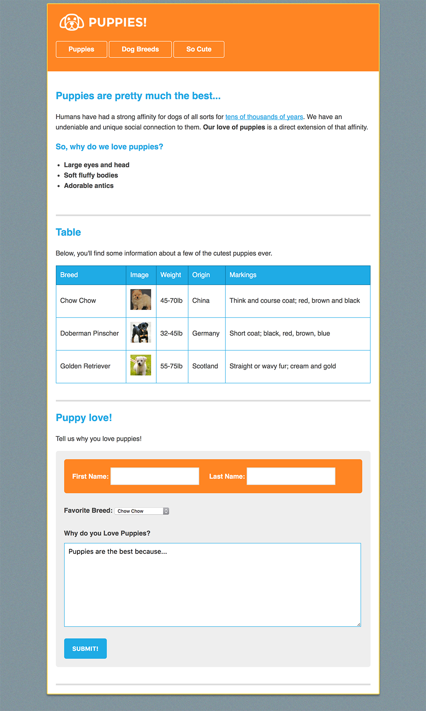

TODO:

A completed commit was pushed. However I need to revisit this to address the following:

- [X] 1. Make this match the markup image.
- [X] 2. Remove 'old' directory.
- [ ] 3. Responsive Design:
  - [ ] a. Make this look appropriate on mobile devices.
    - [ ] i. Refactor code such that the structure is appropriate.
        - [ ] 1. Create a js file. Move the JavaScript code over to the new js file.
        - [X] 2. Style header such that 'Dog Breeds' is on one line.
    - [ ] ii. Style table.
        - [X] 1. 'Breed', 'Image', 'Weight', 'Origin', and 'Markings' are not the right size.
    - [ ] iii. Style form.
        - [X] 1. 'First Name', 'Last Name', 'Favorite Breed', 'Why do you love puppies', 'First Name', 'Second Name', 'Pick One', and 'Puppies are the best because...' are not the right size.
        - [ ] 2. 'Puppies are the best because...' is not the right size.
        - [ ] 3. The first name and last name input fields are not lined up.
  - [ ] b. Make this look appropriate on tablet devices.
    - [ ] i. Refactor code such that the structure is appropriate.
    - [ ] ii. Style header such that 'Dog Breeds' is on one line.
    - [ ] iii. Style table.
    - [ ] iv. Style form.
  - [ ] c. Make this look appropriate on desktop/laptop devices.
    - [ ] i. Style header to match the mockup.
- [ ] 5. Clean up tags (id and class) so the css consists of as few of lines of code as necessary.
- [ ] 6. Delete commented out, unused code.
- [X] 7. Make gh-pages branch.
- [ ] 8. Push to master branch.
- [ ] 9. Push to gh-pages.

from: https://newline.theironyard.com/cohorts/15/courses/9/projects/39

Your task is to review index.png and index.html and to write the CSS to match the mockup listed below.

Getting Started

Inside, you'll find a resources folder and a starter_files folder. The resources folder contains the screenshot of the final HTML page, but you can just use the one below.

The starter_files folder contains the starter HTML file, the img folder (containing all of the images for the page), and a blank CSS file. The CSS file is already linked up to the HTML file, so you can go ahead and code away with your styles.

Mockup  

